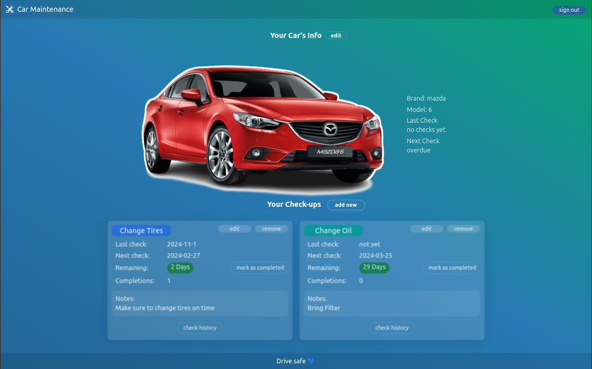
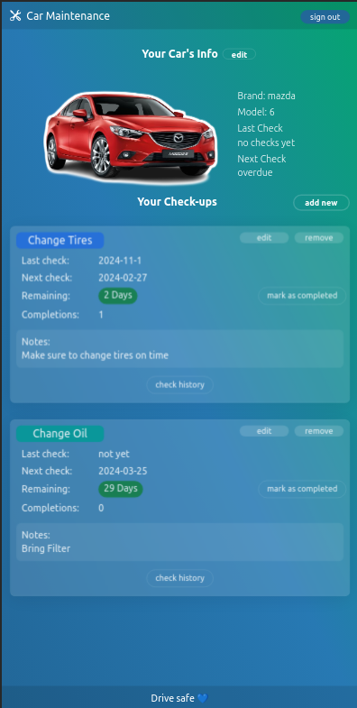

## **Car Maintenance Tracker (REST API/React App)**

This is a full-stack project consisting of two applications
- Back-end application; Built using Node.js/Express.js/MongoDB acting as a REST API [[ Go to folder for more details ]](https://github.com/SheriffKoder/carmaint-rest-full/tree/main/car-maint-rest-api)
- Front-end application; Built ReactJS w/ Typescript & TailwindCSS to display UI to the users and access the REST API [[ Go to folder for more details ]](https://github.com/SheriffKoder/carmaint-rest-full/tree/main/car-maint--react-rest)
##
>**Description - [[ Live Demo ]](https://carmaint-rest-full-react.vercel.app/)**

This app will help you stay on track on keeping your car well maintained.
Where you can access it on any device that has a browser.
The app allows you to add details for your car
and add multiple checkups, each with a different name, color and due date.
but not just track with a due date, also a check history and know where this check was completed and how many times.

>**How to use**
- **[ Setup your account ]**
- Sign-up or login to you your account
- Add a car to be promoted to access your profile.
- Where you can edit the car's info or delete the car (deleting will remove all checkups).
######
- **[ Add a checkup ]**
- Add a new checkup
- Choose the checkup title, the title's color and see how it looks before applying.
- Select the next due date and add some notes.
- Select an initial date if this checkup has been done before adding on the application for reference (optional).
- Once added, you can see how many days remaining till the next check with a color indicator (Green=far ahead, Yellow=should do it soon, Red=overdue).
######
- **[ Edit your checkups ]**
- Edit/remove added checkups.
- Once done with a checkup, mark it as completed.
######
- **[ When the checkup is completed you can ]**
- Update the checkup to add a new due date.
- Check the checkup history to view/edit/remove from previous completions.
######
- Use the navigation links, back to home to navigate through the app and the navigation bar to sign-out.
